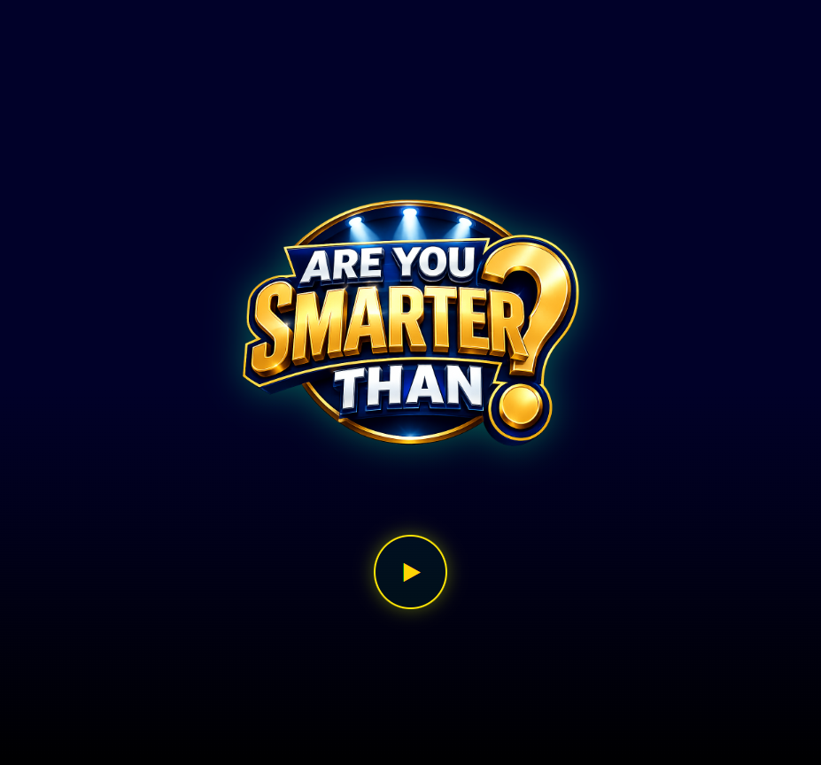
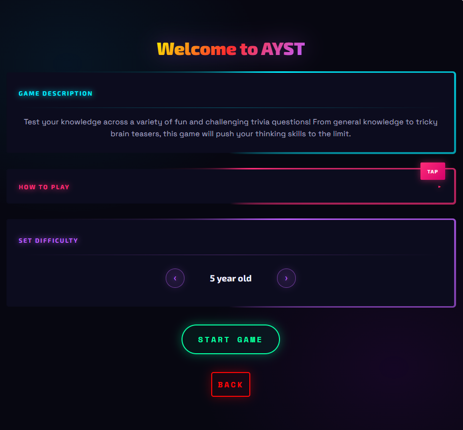
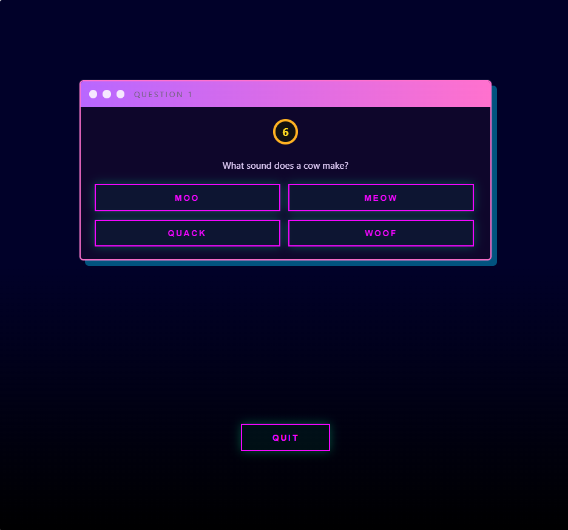
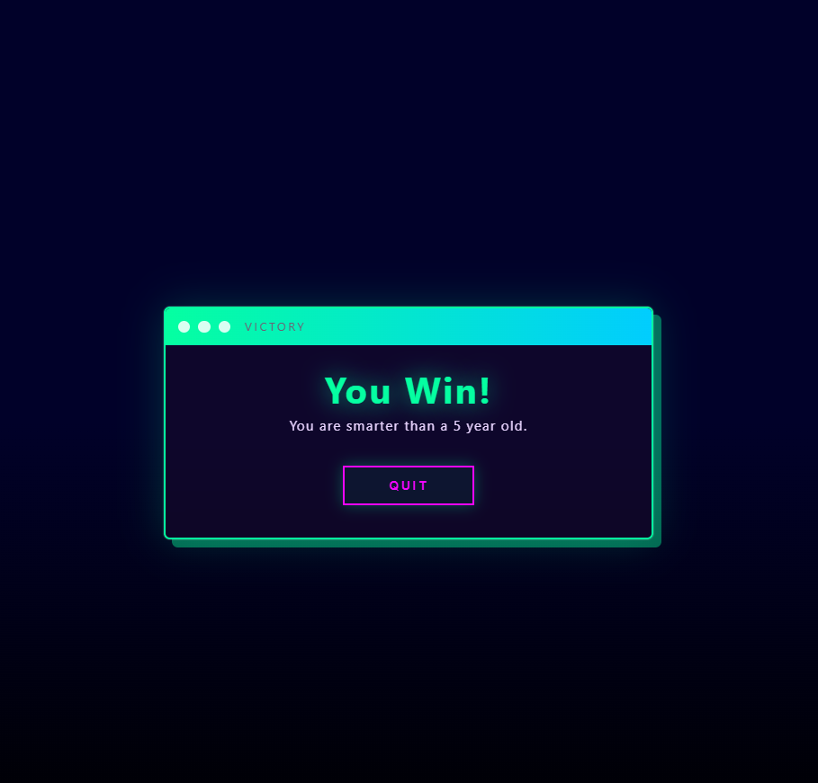
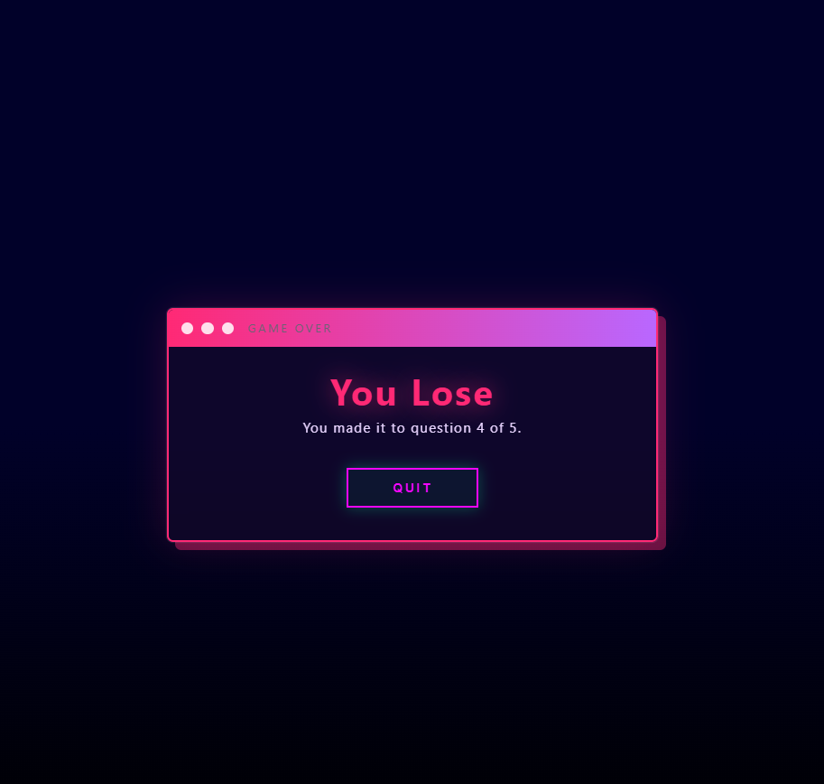

# Are You Smarter Than? (AYST)

## Project Description

Are You Smarter Than? (AYST) is a React-based trivia quiz game inspired by educational challenge shows. Players select a difficulty level and answer a series of randomly selected multiple-choice questions to test their knowledge.

The game features three difficulty levels:

* 5 Year Old
* 8th Grader
* Scholar

Players must answer five questions correctly to win. Questions and answer choices are randomized each game, and progress is automatically saved using session storage so users can continue after refreshing the page.

---

## Technologies Used

### Frontend

* React
* React Router DOM
* JavaScript
* CSS3

### Browser APIs

* Session Storage API

### Build Tool

* Vite

---

## Installation and Setup

### Prerequisites

Ensure the following are installed:

* Node.js
* npm

### Clone the Repository

```bash
git clone https://github.com/akshaykrishna47/Are-You-Smarter-Than-.git
cd Are-You-Smarter-Than-
```

### Install Dependencies

```bash
npm install
```

### Start Development Server

```bash
npm run dev
```

Open your browser and navigate to:

```text
http://localhost:5173
```

### Build for Production

```bash
npm run build
```

### Preview Production Build

```bash
npm run preview
```

---

## Live Demo

Live Application:

[https://Are-You-Smarter-Than.com](https://akshaykrishna47.github.io/Are-You-Smarter-Than-/)

---

## Features

### Home Page

* Neon-themed landing page
* Game logo display
* Start button navigation

### Menu Page

* Game description
* Expandable "How to Play" section
* Difficulty selection controls
* Start game button

### Quiz Page

* Randomized questions
* Randomized answer options
* Animated answer feedback
* Progress tracking

### Game Over Screen

* Victory screen
* Defeat screen
* Restart/Quit functionality

### Session Persistence

* Saves quiz progress automatically
* Allows users to continue after refreshing the page

---

## Project Structure

```text
src/
│
├── components/
│   ├── Home.jsx
│   ├── Menu.jsx
│   ├── Quiz.jsx
│   ├── easyQns.js
│   ├── medQns.js
│   └── hardQns.js
│
├── images/
│   └── logo.png
│
├── App.jsx
├── App.css
└── main.jsx
```

---

## Screenshots

### Home Page



### Menu Page



### Quiz Page



### Victory Screen



### Game Over Screen



---

## Future Improvements

* Leaderboard system
* Additional question categories
* Sound effects and music
* User accounts and progress tracking
* Difficulty progression system

---

## Author

Developed as part of a React web application project.
